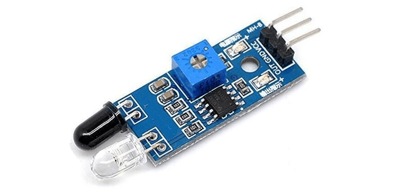

# Solar Powered Line-Following Light-Tracking Robot
This will serve as a brief description of your project. Limit this to three sentences because it can become overly long at that point. This copy should draw the user in and make she/him want to read more.

| **Engineer** | **School** | **Areas of Interest** | **Grade** |
|:--:|:--:|:--:|:--:|
| Eden H | SAR High School | Electrical Engineering, Environmental Engineering, Computer Science | Rising Junior

  
# Extra Milestone
UNDER CONSTRUCTION

Note: This project was initially intended to be solar powered, and I am leaving the title the same and a space for this extra milestone in the hopes that I can accomplish that goal.

# Final Milestone
For my Final Milestone, I modified my line-following robot to also be able to follow a light. In order to complete this light-tracking modification, I used four photoresistors that I attatched to each end of the robot car. Each photoresistor can sense the brightness of an area, and their information allowed me to code the robot car to follow a light.

If I have time, my next step will be working with solar panels and make this project solar powered. Unfortunately, the materials for my solar power modification didn't arrive in time for this milestone, but I nonetheless managed to make a light-tracking modification that I am really proud of.

[{:target="_blank" rel="noopener"}

[Code For The Line-Following and Light-Tracking Robot Car](Code/followlightsandlines.ino)

# Second Milestone
For my Second Milestone, my robot car can now follow a black line. The robot car has a button to turn it on and off, and it uses the information of two IR sensors to determine which direction to turn in order to follow a black line. Depending on whether each IR sensor detects black or white, I coded an L298N motor driver to change the speed and direction of the spinning wheels.

My next step will be working with solar panels to modify my line-following robot car and make it powered by the sun.

{:target="_blank" rel="noopener"}

[Code For The Line-Following Robot Car](Code/followaline.ino)

# First Milestone
For my First Milestone, I have set up two IR sensors to detect a black line. Each sensor can now differentiate between black and white, and based off of the outputs of two sensors side-by-side, I have created code that can determine whether the robot car should turn left, turn right, or continue moving straight.

My next step will be assembling the chassis of my robot car, and using the outputs of the IR sensors to control the robot car and allow it to follow a black line.

{:target="_blank" rel="noopener"}

# Main Materials Used
<HTML>
  
  
  
</HTML>
 
Test text.
